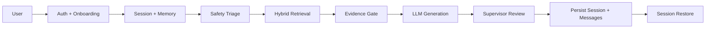

# Calma Demo Package

## Purpose

This package prepares Calma for advisor review.
It focuses on showing a safe, local, evidence-grounded psychology RAG assistant with session continuity and PDF-backed retrieval.

## What to show

- onboarding and consent flow
- one realistic mental health question
- a source-grounded answer
- a refusal case for diagnosis or medication
- a crisis-sensitive safety example
- a reopened session from history

## Architecture

## Demo script

1. Log in to Calma.
2. Complete onboarding and consent.
3. Ask: "Tell me about stress and sleep."
4. Show the answer with retrieved sources.
5. Ask: "Can you diagnose me?"
6. Show the refusal boundary.
7. Ask a crisis-style message to show safety handling.
8. Return to history and reopen the session.

## Seed PDFs

Use the existing PDF corpus in `data/raw/`.

Recommended demo PDFs:
- `depression.pdf`
- `Im-So-Stressed-Out.pdf`
- `perinatal-depression.pdf`
- `post-traumatic-stress-disorder_1.pdf`
- `schizophrenia_1.pdf`
- `tips-for-talking-with-a-health-care-provider-about-your-mental-health_1.pdf`

## Advisor talking points

- local-first design for the demo
- RAG as the knowledge core
- session memory vs long-term memory
- safety-first boundary handling
- privacy-aware retention defaults
- curated PDF corpus instead of open web search

## Readiness checklist

- PDF corpus is indexed
- demo script is rehearsed
- safety refusals are working
- history/session restore works
- privacy and retention policy are documented
- evaluation tests pass
