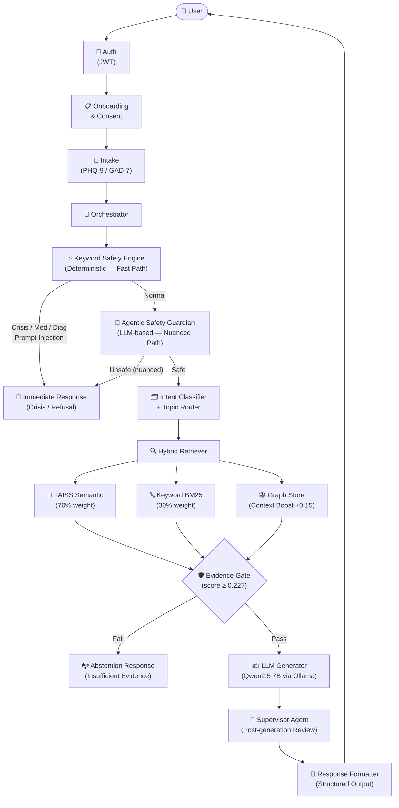
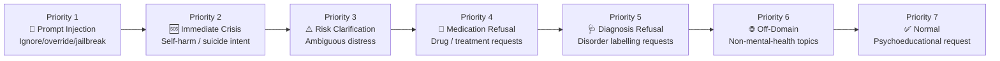
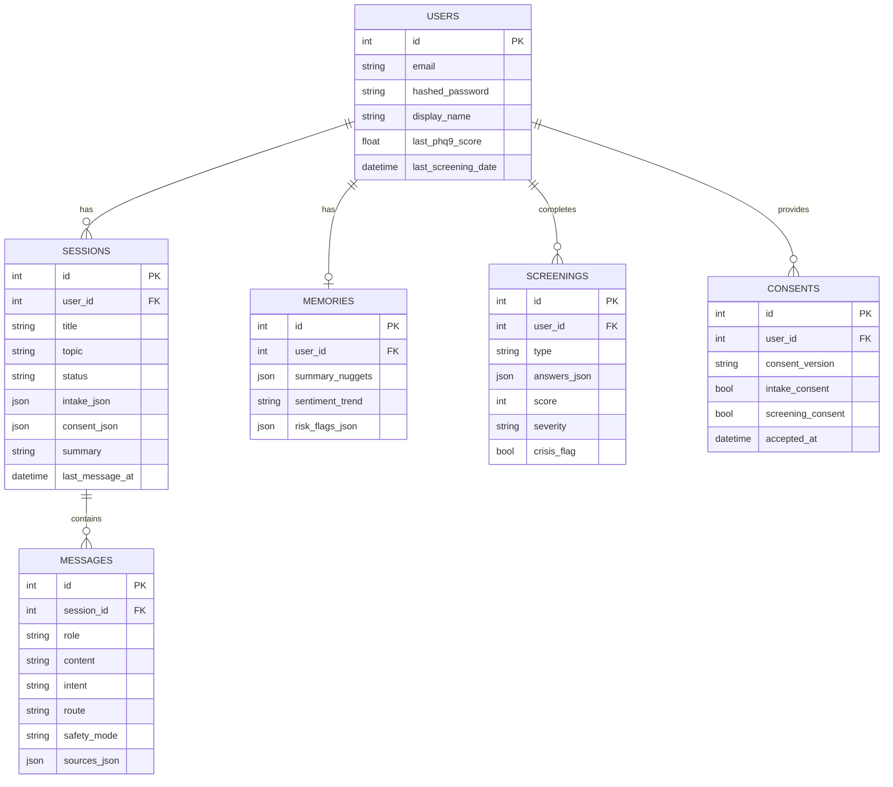
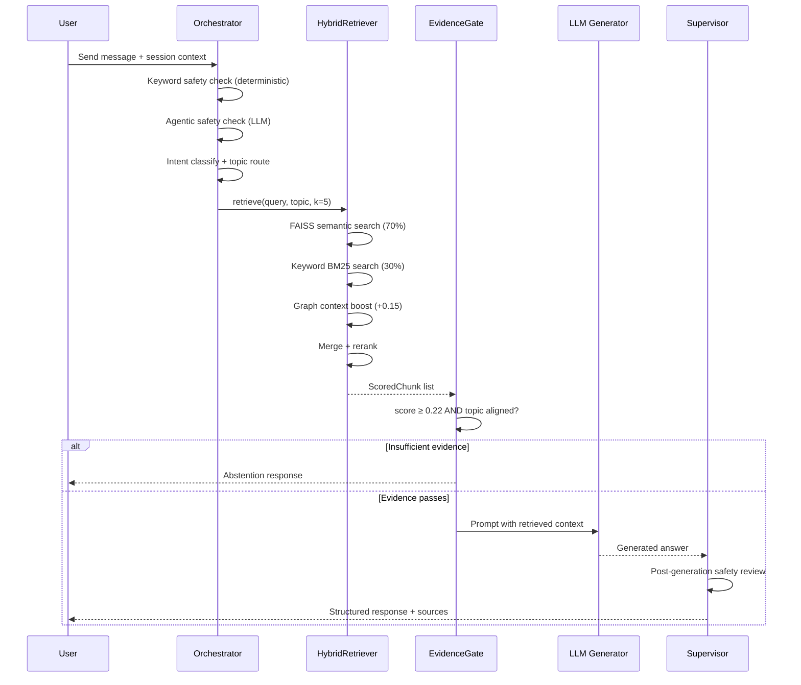
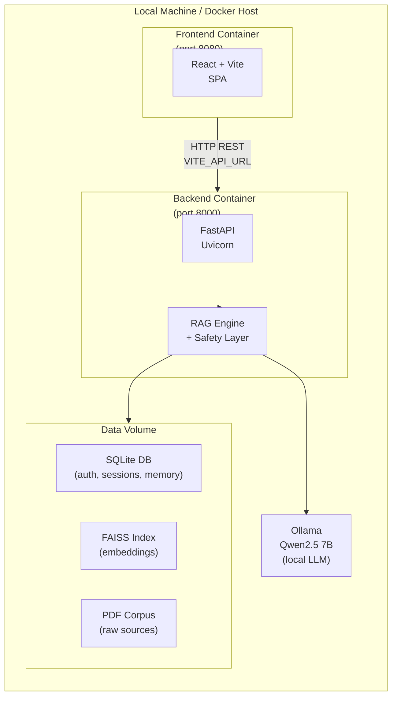

# Calma — System Architecture

This document describes the technical architecture of **Calma**, a psychology-oriented, safety-aware psychoeducational RAG assistant.

---

## 1. System-Level Flow

---

## 2. Safety Priority Chain

The safety system applies rules in strict priority order. Once a rule matches, later rules are not evaluated.

Each priority level maps to a **SafetyMode** and triggers a different response template. The dual-layer design (keyword → LLM agentic) ensures both speed (deterministic path) and nuance recall (LLM path for paraphrase attacks).

---

## 3. Data Layer

---

## 4. RAG Pipeline Detail

---

## 5. Deployment Architecture

### Deployment Notes

- The backend container runs in production-style mode by default.
- Local development keeps hot reload in `compose.override.yaml`, not in the base image contract.
- Runtime database and FAISS state persist through the named Docker volume `calma_store`.
- The backend runtime drops to a non-root user after preparing writable data paths.

---

## 6. Agent Ecosystem

| Agent | Role | Trigger |
|-------|------|---------|
| **Orchestrator** | Central coordinator — routes every message | Every request |
| **SafetyGuardian** | LLM-based nuanced safety analysis | After keyword safety passes |
| **SentimentAgent** | Detects emotional tone → adjusts response style | Every psychoeducation response |
| **MemoryAgent** | Reads/writes cross-session user memory | Session start/end |
| **RetrievalGrader** | CRAG-style evidence validation | After FAISS retrieval |
| **Supervisor** | Post-generation safety review | After LLM generation |

---

## 7. Layer Boundaries

The repository uses a one-way dependency flow so the RAG engine stays isolated from transport and delivery concerns.

| Layer | Canonical Modules | Responsibility |
|-------|-------------------|----------------|
| Interface | `server.app.api`, `server.run`, `client/` | HTTP transport, UI, request/response shaping |
| Application | `backend.app.services` | Orchestration, workflow coordination, persistence use-cases |
| Domain / Core | `backend.app.core` | Safety, routing, retrieval, generation, agent logic |
| Persistence / Infra | `backend.app.models`, `backend.app.core.database`, `backend.app.utils.io` | Storage models, DB access, file I/O |
| Shared config | `backend.app.config`, `backend.app.utils.prompts` | Static settings and prompt templates |

Allowed import direction:
- `backend.app.api` may import `services`, `core`, `models`, and shared utils.
- `backend.app.services` may import `core`, `models`, and shared utils.
- `backend.app.core` must not import `api` or `frontend`.
- `backend.app.models` may depend on persistence helpers only.
- `backend.app.utils` must stay generic and avoid depending on higher layers.

RAG boundary:
- The RAG engine lives in `backend.app.core`.
- Delivery code, UI code, and container entrypoints stay outside the engine.
- `backend.app.services.assistant` coordinates the engine but does not own retrieval or safety policy logic.

*Last updated: 2026-05-09*
